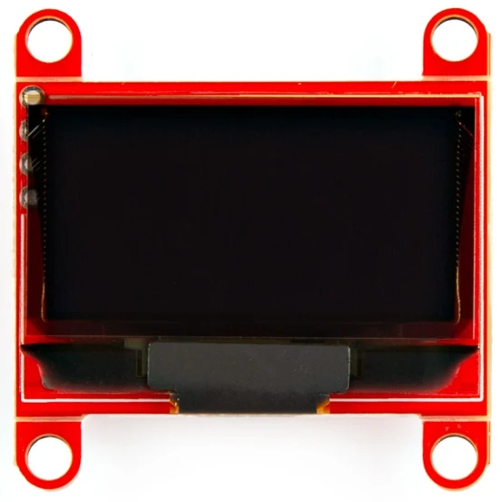
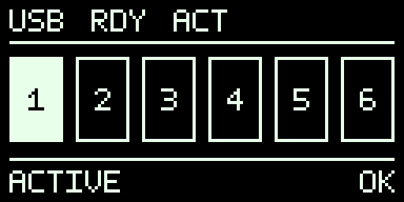
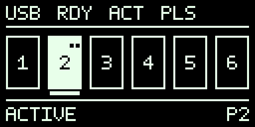
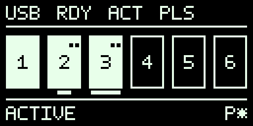
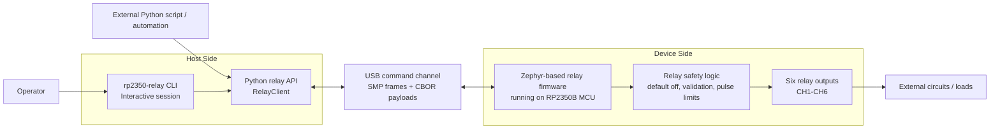

# RP2350 Relay 6CH

Zephyr firmware and Python host tooling for the Waveshare RP2350-Relay-6CH and
RP2350-Relay-6CH-W controllers.

The firmware controls six relay outputs, exposes a custom Zephyr MCUmgr/SMP
relay management group, and provides USB CDC transport for host control. The
host side includes an importable Python RPC library, smoke-test helpers, and a
library-backed CLI. Firmware update support is planned but not implemented.

Raspberry Pi Pico 2 and Pico 2 W are also supported as DIY relay targets when
an explicit six-relay devicetree overlay maps `CH1` through `CH6`; see
[Pico 2 DIY targets](docs/pico-diy-targets.md).

<p>
  
  
</p>

Product photos show the Wi-Fi version, `RP2350-Relay-6CH-W`.

## Operator And Automation Experience

RP2350 Relay 6CH is a complete host-control stack for Waveshare
RP2350-Relay-6CH boards and Pico 2 relay builds. It gives operators an
interactive terminal workflow, gives Linux deployments a local daemon and
`systemd --user` service path, and gives automation authors a Python library
for custom test rigs, lab benches, and local control tools.

The main control surfaces are:

- `rp2350-relay session` for cross-platform manual operation. It supports USB
  discovery, long-lived serial ownership, reconnect-oriented operation, and
  safer teardown behavior for bench use.
- `rp2350-relayd` with `rp2350-relayctl` for Linux service-style operation. One
  daemon owns one relay controller, exposes a local Unix socket, supports named
  instances, reports daemon status, polls heartbeat, and can run under
  `systemd --user`.
- The Python host library for broader automation. Use `RelayClient` for direct
  serial control, discovery helpers to find relay controllers, and
  `RelayDaemonClient` when automation should talk through a running daemon.

| User goal | Interface |
| --- | --- |
| Manual bench operation | `rp2350-relay session` |
| Linux local service deployment | `rp2350-relayd` and `rp2350-relayctl` |
| Custom Python automation or test rigs | Host library with `RelayClient` or `RelayDaemonClient` |
| Multi-device Linux host | One daemon instance and socket per relay controller |
| Pico 2 DIY relay target | Same host tooling after flashing a supported overlay build |

## Product Build Experience

The source checkout builds the product, not just one firmware image. The main
developer command builds the Python host wheel and the supported Waveshare and
Pico 2 firmware UF2 images together:

```sh
scripts/build.sh
```

Choose a supported product composition with a lunch target:

```sh
scripts/build.sh --lunch rp2350_relay_6ch-standard-userdebug
scripts/build.sh --lunch rp2350_relay_6ch-boardfarm-userdebug
scripts/build.sh --dry-run --lunch rp2350_relay_6ch-standard-userdebug
```

Intermediate outputs are isolated under `build/product/<lunch>/`, while release
artifact names and the versioned product manifest stay stable under `dist/`.
YAML product configs keep release composition readable as firmware fragments
grow. See
[Product build contract](docs/product-build.md) for the full build interface.

## Local Indicators

Local indicators provide nearby diagnostic feedback without becoming a relay
control surface or an authoritative automation interface. RGB LED, buzzer, and
OLED state mirror firmware-owned controller facts; host command responses and
status queries remain authoritative.

The optional 128x64 SSD1306 OLED display shows compact relay status using fixed
annunciators, six relay cells, and a short status band. Filled cells mean the
firmware commanded that channel on or has an active pulse for that channel; the
display does not prove relay contact closure, load voltage, or current flow.
Display-capable firmware treats a missing OLED as normal.

<table>
  <tr>
    <td>
      
    </td>
    <td>
      
    </td>
    <td>
      
    </td>
    <td>
      
    </td>
  </tr>
</table>

See [OLED indicator](docs/oled-indicator.md) for the display contract,
[Status indicators](docs/status-indicators.md) for RGB LED and buzzer behavior,
and [OLED indicator UI discussion](docs/discussions/oled-indicator-ui.md) for
design background.

## Architecture

The host side has two common control paths: Linux daemon-based host control,
and cross-platform direct host control.

In the diagrams, `Python relay API` names the role used by Python automation.
The concrete class depends on the control path: direct host control uses
`RelayClient`, while daemon-based host control uses `RelayDaemonClient`.
Inside daemon mode, `RelayClient` is internal to `rp2350-relayd`.

### Linux Daemon-Based Host Control



```mermaid
flowchart LR
  operator["Operator"]
  automation["External Python script / automation"]

  subgraph client["Host Client"]
    relayctl["rp2350-relayctl\nclient CLI"]
    daemon_api["Python relay API\nRelayDaemonClient"]
  end

  socket["Local Unix socket\nNDJSON daemon protocol"]

  subgraph server["Host Server"]
    daemon["rp2350-relayd\nlocal daemon"]
    direct_api["RelayClient\ninternal to rp2350-relayd"]
  end

  protocol["USB command channel\nSMP frames + CBOR payloads"]

  subgraph device["Device Side"]
    zephyr["Zephyr-based relay firmware\nrunning on RP2350B MCU"]
    safety["Relay safety logic\ndefault off, validation, pulse limits"]
    relays["Six relay outputs\nCH1-CH6"]
  end

  loads["External circuits / loads"]

  operator --> relayctl
  automation --> daemon_api

  relayctl <--> socket
  daemon_api <--> socket
  socket <--> daemon
  daemon --> direct_api
  direct_api <--> protocol

  protocol <--> zephyr
  zephyr --> safety
  safety --> relays
  relays --> loads
```

### Direct Host Control Without Daemon



## Features

Implemented:

- Safe six-channel relay control for `CH1` through `CH6`.
- Default-off relay behavior on boot, reset, firmware restart, and test
  setup/teardown.
- Role-oriented identity, capability, build, status, health, transport,
  safety, watchdog, relay control, heartbeat, and reboot command handling
  through a custom MCUmgr/SMP management group.
- USB CDC SMP transport for host control.
- Python RPC library with typed transport, timeout, protocol, validation, and
  device errors.
- Interactive `rp2350-relay session` mode with discovery, reconnect handling,
  and safer long-lived manual operation.
- Linux `rp2350-relayd` daemon mode with `rp2350-relayctl` client commands,
  daemon status reporting, and background heartbeat polling.
- CLI utilities for session operation, daemon-client commands, JSON output, and
  hardware smoke tests.
- Local WS2812 RGB status indication, bounded buzzer feedback, and optional
  128x64 SSD1306 OLED status display.
- Host-side tests with simulated transports and firmware tests for relay and
  relay-management behavior.

Planned:

- MCUboot-compatible A/B firmware update and rollback support.
- Host library and CLI firmware image upload, test-image, and confirm-image
  workflows.
- Firmware signing, flashing, and release helper scripts.
- Best-effort device-originated SMP event frames for future lifecycle, fault,
  and monitoring notifications.

## Current Status

- Default board target: `waveshare_rp2350_relay_6ch/rp2350b/m33`.
- Optional Wi-Fi board target:
  `waveshare_rp2350_relay_6ch/rp2350b/m33/w`.
- Relay outputs: `CH1` through `CH6` on GPIO26 through GPIO31.
- Relay polarity: active high unless board testing proves otherwise.
- Host control: Python RPC library and CLI over the configured SMP serial route.
- Local OLED display support is optional; display-capable firmware treats a
  missing OLED as normal, and OLED state is a local diagnostic rather than an
  authoritative host status source.
- Safety requirement: all relays default off on boot, reset, firmware restart,
  and test setup/teardown.

## Prerequisites

Choose the path that matches your role.

Operators need:

- Python 3.12 or newer.
- Release artifacts from the same GitHub Release:
  `rp2350_relay_6ch-<version>-py3-none-any.whl` and the matching `.uf2`
  firmware image.
- Waveshare RP2350-Relay-6CH or RP2350-Relay-6CH-W hardware with USB access.
- Safe relay-side wiring with hazardous loads disconnected during first flash
  and smoke test.

Developers need:

- Zephyr workspace with the Zephyr SDK/toolchain installed.
- Zephyr workspace virtual environment, normally
  `${ZEPHYR_WORKSPACE:-$HOME/zephyrproject}/.venv`.
- This repository checked out under the Zephyr workspace.
- Python host package dependencies installed in editable mode.

## Quick Start

### Operator Quick Start

Use this path to install released tools and flash released firmware. No source
checkout or Zephyr workspace is required.

1. Download the wheel and matching Waveshare UF2 from the same GitHub Release:
   `rp2350_relay_6ch-<version>-py3-none-any.whl` and
   `rp2350_relay_6ch-<version>-waveshare.uf2`.

2. Flash the firmware.

   UF2 drag-and-drop:

   ```text
   Put the board in USB bootloader mode.
   Copy rp2350_relay_6ch-<version>-waveshare.uf2 to the mounted RP2350 drive.
   Reconnect the board normally.
   ```

   Or use `picotool` while the board is in USB bootloader mode:

   ```sh
   picotool load -x rp2350_relay_6ch-<version>-waveshare.uf2
   ```

3. Install the CLI wheel. The wheel requires Python 3.12 or newer.

   Windows PowerShell:

   ```powershell
   python -m pip install --user pipx
   python -m pipx ensurepath
   python -m pipx install .\rp2350_relay_6ch-<version>-py3-none-any.whl
   ```

   Linux shell:

   ```sh
   python3 -m pip install --user pipx
   python3 -m pipx ensurepath
   python3 -m pipx install ./rp2350_relay_6ch-<version>-py3-none-any.whl
   ```

   If Linux system Python is older than 3.12 and cannot be upgraded, use a
   conda environment with Python 3.12, then install the wheel with
   `python -m pip install ./rp2350_relay_6ch-<version>-py3-none-any.whl`.
   A venv created from any available Python 3.12 or newer binary is also
   supported.

4. Verify the board from the machine connected to the USB device port:

   ```sh
   rp2350-relay --port <serial-port> identity
   rp2350-relay --port <serial-port> smoke
   ```

   Use `COM7`-style ports on Windows and `/dev/ttyACM0`-style ports on Linux.
   If Linux reports permission denied for `/dev/ttyACM*`, add the user to
   `dialout` and log out/in; see [CLI utility](docs/cli.md#linux-serial-permissions).
   Confirm all relays are off after the smoke test.

Some releases may also provide a platform executable as a convenience add-on.
Use it when avoiding a Python install matters, but keep the wheel path as the
default documented install flow.

Full operator install, upgrade, and CLI details are in
[CLI utility](docs/cli.md). For Pico 2 DIY firmware artifacts, see
[Pico 2 DIY targets](docs/pico-diy-targets.md).

### Developer Quick Start

Use this path to build firmware and run tests from source.
Run these commands from the repository root after completing the Zephyr setup:

```sh
source "${ZEPHYR_WORKSPACE:-$HOME/zephyrproject}/.venv/bin/activate"
python -m pip install -e . pytest
scripts/test-host.sh
scripts/build.sh
scripts/flash.sh
rp2350-relay --port <serial-port> smoke
```

`scripts/build.sh` builds the host wheel and supported firmware images. It
defaults to:

```text
LUNCH=rp2350_relay_6ch-standard-userdebug
```

For first-time setup and full verification commands, see
[Development setup](docs/development-setup.md).

## Host Usage

Use [CLI utility](docs/cli.md) for full session mode, Linux daemon mode,
`systemd --user`, JSON output, and exit-code details. Use
[Host library](docs/host-library.md) for Python discovery, direct clients,
daemon clients, and multi-device automation examples.

### Linux Daemon-Based Host Control

#### Daemon Deployment

File: `~/.config/rp2350-relay/config.toml`

```toml
[instances.bench-a]
serial = "E6614C311F4B8B2F"
socket = "${XDG_RUNTIME_DIR}/rp2350-relay/bench-a.sock"
wait_device = true
```

Commands:

```sh
rp2350-relayctl systemd install
systemctl --user daemon-reload
systemctl --user enable --now rp2350-relayd@bench-a
rp2350-relayctl --instance bench-a daemon-status
```

#### Python RelayDaemonClient

The daemon owns the serial port and polls heartbeat internally. Automation can
use `daemon_status()` to observe daemon connection state.

```python
from rp2350_relay_6ch import RelayDaemonClient
from rp2350_relay_6ch.config import resolve_socket_for_instance

socket_path = resolve_socket_for_instance(instance="bench-a")

with RelayDaemonClient.connect(socket_path, timeout_s=2.0) as relay:
    relay.daemon_status()
    relay.pulse_relay(0, 100)
```

### Direct Host Control

#### Interactive Session

<pre style="background: #1b1b1b; color: #f2f2f2; padding: 12px; overflow-x: auto;"><code>$ <span style="color: #00d084;">rp2350-relay</span> session
Relay USB candidates:
  1. port=/dev/ttyACM0 serial=E6614C311F4B8B2F product=RP2350-Relay-6CH SMP CDC
Select device number, or q to cancel: 1
╭──────────────────────────────────────────────────────────────╮
│   RP2350 Relay Session                                       │
│                                                              │
│   Connection:   <span style="color: #00ff99;">connected</span>                                    │
│   Port:         /dev/ttyACM0                                 │
│   Serial:       E6614C311F4B8B2F                             │
│   Hardware:     Waveshare RP2350-Relay-6CH                   │
│   Protocol:     9                                            │
│   Relay count:  6                                            │
│   State:        0x00                                         │
│   On:           <span style="color: #ff4dff;">none</span>                                         │
│   Pulsing:      <span style="color: #ff4dff;">none</span>                                         │
╰──────────────────────────────────────────────────────────────╯
<span style="color: #00d084;">rp2350-relay</span>[<span style="color: #00bfff;">/dev/ttyACM0</span>]$ <span style="color: #d7eaff;">help</span>
Inspect:
  identity                     show controller hardware and protocol information
  capabilities                 show controller capabilities
  build-info                   show firmware build details
  get &lt;channel&gt;                show one relay state
  get-all                      show all relay states
  status                       show relay state, health, and uptime
  health                       show health details
  transport                    show transport details
  safety                       show safety policy details
  watchdog                     show watchdog details

Control:
  set &lt;channel&gt; &lt;on|off&gt;       set one relay
  set-all &lt;mask&gt;               set all relays from a six-bit mask
  pulse &lt;channel&gt; &lt;duration&gt;   pulse one relay for duration in ms
  off-all                      turn every relay off and cancel pulses
  smoke [--pulse-ms &lt;ms&gt;]      pulse each relay and turn all off
  reboot                       request a controlled firmware reboot
  bootsel                      enter RP2350 ROM BOOTSEL for picotool or UF2

Connection:
  disconnect                   close the current serial connection
  connect                      connect using saved selector or discovery
  help                         show session commands
  exit                         leave the session
  quit                         leave the session</code></pre>

#### Python RelayClient

Direct Python automation owns the serial connection. For link-health polling,
call `relay.heartbeat()` on a regular background interval; see
[Host library](docs/host-library.md#heartbeat-polling) for the serialized
heartbeat loop pattern.

```python
from rp2350_relay_6ch import RelayClient
from rp2350_relay_6ch.discovery import select_device_by_serial

device = select_device_by_serial("E6614C311F4B8B2F")

with RelayClient.connect(device.port, timeout_s=2.0, retries=1) as relay:
    relay.identity()
    relay.capabilities()
    relay.pulse_relay(0, 100)
    relay.off_all_relays()
```

See [CLI utility](docs/cli.md), [Host library](docs/host-library.md), and
[Pico 2 DIY targets](docs/pico-diy-targets.md) for complete setup and usage.

## Repository Layout

```text
firmware/   Zephyr application sources, config, board files, and tests
host/       Python package and host-side tests
scripts/    Build, test, flash, release, and smoke-test entry points
tools/      CLI entry points and operational helpers
docs/       Requirements, hardware notes, phase plans, protocol, and tests
```

## Documentation

- [Product requirements](docs/prd.md)
- [Development setup](docs/development-setup.md)
- [Hardware information](docs/hardware-info.md)
- [Pico 2 DIY targets](docs/pico-diy-targets.md)
- [Implementation plan](docs/implementation-plan.md)
- [Relay management protocol](docs/protocol/relay-management.md)
- [Host library](docs/host-library.md)
- [Device-originated SMP events discussion](docs/discussions/device-originated-smp-events.md)
- [CLI utility](docs/cli.md)
- [Status indicators](docs/status-indicators.md)
- [OLED indicator](docs/oled-indicator.md)
- [Test procedures](docs/testing/test-procedures.md)
- [Relay smoke test](docs/testing/relay-smoke-test.md)
- [USB RPC smoke test](docs/testing/usb-rpc-smoke-test.md)

Phase plans and verification reports live under `docs/phase-*-plan.md` and
`docs/testing/phase-*-verification.md`.

## Safety Notes

### Communication-Loss Safety

- Session mode and daemon mode keep firmware communication ownership alive with
  heartbeat while they control the board.
- If that communication is lost while relays are energized, supported timeout
  builds cancel active pulses and turn all relays off.
- Local indicators may report owner-lost or reboot-pending attention states.
  Restore the session or daemon, then use the `status` command, and verify relay
  state before resuming normal operation.
- This behavior is a local relay safety fallback, not persistent relay state,
  telemetry, audit logging, or SmartPDU-style mains-power control.

See [communication-loss safety](docs/protocol/relay-management.md#communication-loss-safety)
for policy details and [status indicators](docs/status-indicators.md) for LED,
buzzer, and OLED meanings.

- Do not repurpose GPIO26, GPIO27, GPIO28, GPIO29, GPIO30, or GPIO31; they are
  relay outputs on Waveshare hardware.
- Keep relay outputs off by default and force them off during test teardown.
- Use UART0 for the manual Zephyr shell. Keep USB CDC dedicated to host control
  protocol traffic, and keep UART1 available for the isolated RS485 path.
- Treat MCU `GND` and isolated relay/RS485 `SGND` as separate domains in design
  notes, firmware assumptions, and tests.
