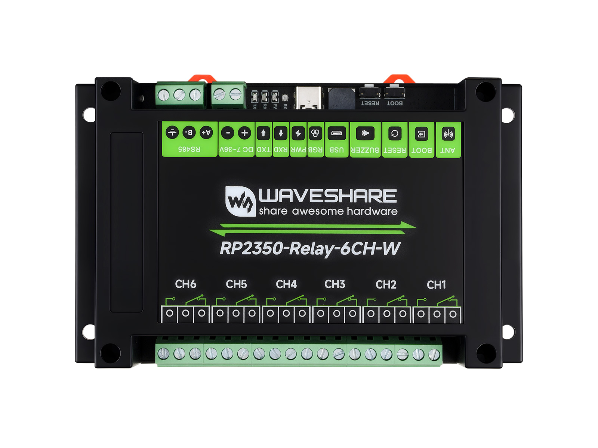
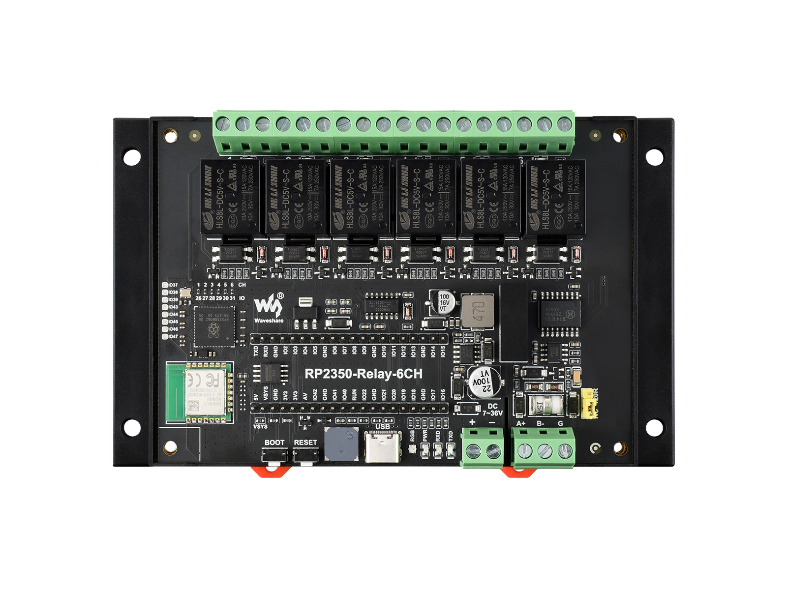
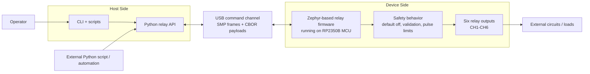

# RP2350 Relay 6CH

Zephyr firmware and Python host tooling for the Waveshare RP2350-Relay-6CH and
RP2350-Relay-6CH-W controllers.

The firmware controls six relay outputs, exposes a custom Zephyr MCUmgr/SMP
relay management group, and provides USB CDC transport for host control. The
host side includes an importable Python RPC library, smoke-test helpers, and a
library-backed CLI. Firmware update support is planned but not implemented.

Raspberry Pi Pico 2 and Pico 2 W are also supported as DIY relay targets when
an explicit six-relay devicetree overlay maps `CH1` through `CH6`; see
[Pico 2 DIY targets](docs/pico-diy-targets.md).

<p>
  
  
</p>

Product photos show the Wi-Fi version, `RP2350-Relay-6CH-W`.

## Architecture



## Features

Implemented:

- Safe six-channel relay control for `CH1` through `CH6`.
- Default-off relay behavior on boot, reset, firmware restart, and test
  setup/teardown.
- Relay get, set, set-all, pulse, off-all, status, info, and reboot command
  handling through a custom MCUmgr/SMP management group.
- USB CDC SMP transport for host control.
- Python RPC library with typed transport, timeout, protocol, validation, and
  device errors.
- CLI utility for manual control, JSON output, scripted checks, and hardware
  smoke tests.
- Host-side tests with simulated transports and firmware tests for relay and
  relay-management behavior.

Planned:

- MCUboot-compatible A/B firmware update and rollback support.
- Host library and CLI firmware image upload, test-image, and confirm-image
  workflows.
- Firmware signing, flashing, and release helper scripts.
- Optional local status indicators for the buzzer and WS2812 RGB LED if they
  do not interfere with relay control or RPC behavior.

## Current Status

- Default board target: `waveshare_rp2350_relay_6ch/rp2350b/m33`.
- Optional Wi-Fi board target:
  `waveshare_rp2350_relay_6ch/rp2350b/m33/w`.
- Relay outputs: `CH1` through `CH6` on GPIO26 through GPIO31.
- Relay polarity: active high unless board testing proves otherwise.
- Host control: Python RPC library and CLI over the configured SMP serial route.
- Safety requirement: all relays default off on boot, reset, firmware restart,
  and test setup/teardown.

## Prerequisites

Choose the path that matches your role.

Operators need:

- Python 3.12 or newer.
- Release artifacts from the same GitHub Release:
  `rp2350_relay_6ch-<version>-py3-none-any.whl` and the matching `.uf2`
  firmware image.
- Waveshare RP2350-Relay-6CH or RP2350-Relay-6CH-W hardware with USB access.
- Safe relay-side wiring with hazardous loads disconnected during first flash
  and smoke test.

Developers need:

- Zephyr workspace with the Zephyr SDK/toolchain installed.
- Zephyr workspace virtual environment, normally
  `${ZEPHYR_WORKSPACE:-$HOME/zephyrproject}/.venv`.
- This repository checked out under the Zephyr workspace.
- Python host package dependencies installed in editable mode.

## Quick Start

### Operator Quick Start

Use this path to install released tools and flash released firmware. No source
checkout or Zephyr workspace is required.

1. Download the wheel and matching Waveshare UF2 from the same GitHub Release:
   `rp2350_relay_6ch-<version>-py3-none-any.whl` and
   `rp2350_relay_6ch-<version>-waveshare.uf2`.

2. Flash the firmware.

   UF2 drag-and-drop:

   ```text
   Put the board in USB bootloader mode.
   Copy rp2350_relay_6ch-<version>-waveshare.uf2 to the mounted RP2350 drive.
   Reconnect the board normally.
   ```

   Or use `picotool` while the board is in USB bootloader mode:

   ```sh
   picotool load -x rp2350_relay_6ch-<version>-waveshare.uf2
   ```

3. Install the CLI wheel.

   Windows PowerShell:

   ```powershell
   python -m pip install --user pipx
   python -m pipx ensurepath
   python -m pipx install .\rp2350_relay_6ch-<version>-py3-none-any.whl
   ```

   Linux shell:

   ```sh
   python3 -m pip install --user pipx
   python3 -m pipx ensurepath
   python3 -m pipx install ./rp2350_relay_6ch-<version>-py3-none-any.whl
   ```

4. Verify the board from the machine connected to the USB device port:

   ```sh
   rp2350-relay --port <serial-port> info
   rp2350-relay --port <serial-port> smoke
   ```

   Use `COM7`-style ports on Windows and `/dev/ttyACM0`-style ports on Linux.
   If Linux reports permission denied for `/dev/ttyACM*`, add the user to
   `dialout` and log out/in; see [CLI utility](docs/cli.md#linux-serial-permissions).
   Confirm all relays are off after the smoke test.

Full operator install, upgrade, and CLI details are in
[CLI utility](docs/cli.md). For Pico 2 DIY firmware artifacts, see
[Pico 2 DIY targets](docs/pico-diy-targets.md).

### Developer Quick Start

Use this path to build firmware and run tests from source.
Run these commands from the repository root after completing the Zephyr setup:

```sh
source "${ZEPHYR_WORKSPACE:-$HOME/zephyrproject}/.venv/bin/activate"
python -m pip install -e . pytest
scripts/test-host.sh
scripts/build-firmware.sh
west flash -d build/firmware
rp2350-relay --port <serial-port> smoke
```

The firmware wrapper defaults to:

```text
TARGET=waveshare
BOARD=waveshare_rp2350_relay_6ch/rp2350b/m33
BUILD_DIR=build/firmware
```

For first-time setup and full verification commands, see
[Development setup](docs/development-setup.md).

## CLI Examples

CLI channel numbers are one-based and match board labels: `1` is `CH1` and `6`
is `CH6`.

```sh
rp2350-relay --port <serial-port> info
rp2350-relay --port <serial-port> get
rp2350-relay --port <serial-port> set 1 on
rp2350-relay --port <serial-port> pulse 1 100
rp2350-relay --port <serial-port> off-all
rp2350-relay --port <serial-port> status
rp2350-relay --port <serial-port> --output json status
```

See [docs/cli.md](docs/cli.md) for the full command list and exit codes.

## Repository Layout

```text
firmware/   Zephyr application sources, config, board files, and tests
host/       Python package and host-side tests
scripts/    Build, test, flash, and smoke-test entry points
tools/      CLI entry points and operational helpers
docs/       Requirements, hardware notes, phase plans, protocol, and tests
```

## Documentation

- [Product requirements](docs/prd.md)
- [Development setup](docs/development-setup.md)
- [Hardware information](docs/hardware-info.md)
- [Pico 2 DIY targets](docs/pico-diy-targets.md)
- [Implementation plan](docs/implementation-plan.md)
- [Relay management protocol](docs/protocol/relay-management.md)
- [Host library](docs/host-library.md)
- [CLI utility](docs/cli.md)
- [Status indicators](docs/status-indicators.md)
- [Test procedures](docs/testing/test-procedures.md)
- [Relay smoke test](docs/testing/relay-smoke-test.md)
- [USB RPC smoke test](docs/testing/usb-rpc-smoke-test.md)

Phase plans and verification reports live under `docs/phase-*-plan.md` and
`docs/testing/phase-*-verification.md`.

## Safety Notes

- Do not repurpose GPIO26, GPIO27, GPIO28, GPIO29, GPIO30, or GPIO31; they are
  relay outputs on Waveshare hardware.
- Keep relay outputs off by default and force them off during test teardown.
- Use UART0 for the manual Zephyr shell. Keep USB CDC dedicated to host control
  protocol traffic, and keep UART1 available for the isolated RS485 path.
- Treat MCU `GND` and isolated relay/RS485 `SGND` as separate domains in design
  notes, firmware assumptions, and tests.
