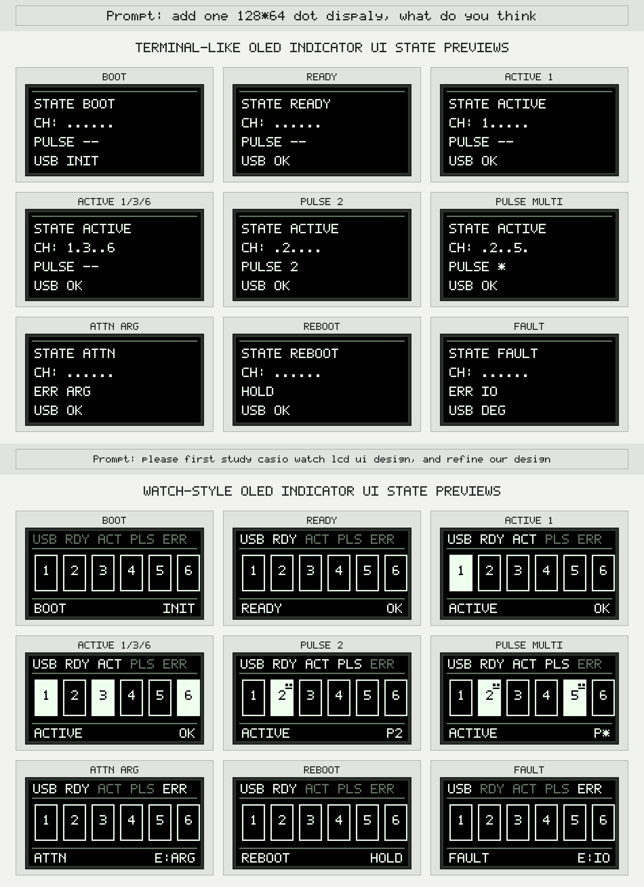
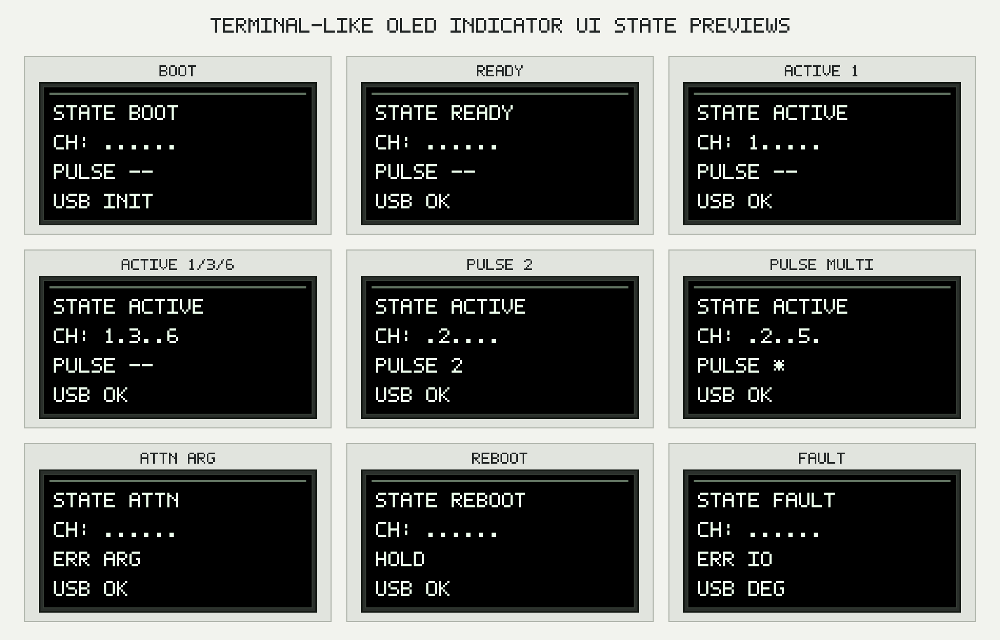
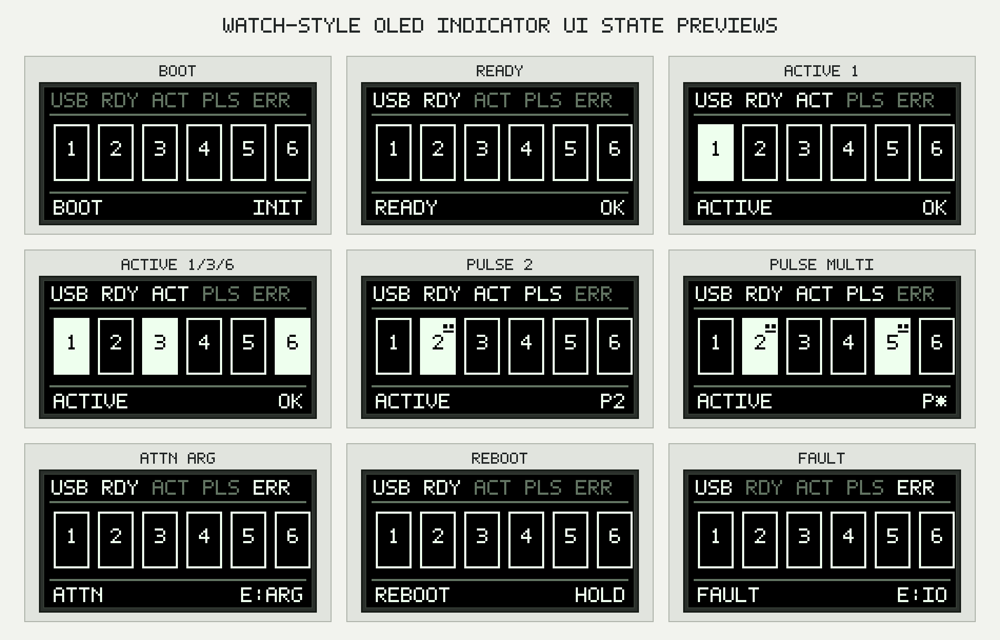

# OLED indicator UI

Date: 2026-05-27

Status: Discussion. This note records product and UI investigation for adding
one 128x64 OLED local indicator to the relay controller. It does not change
the authoritative PRD, implementation plan, phase scope, or verification
status unless those documents are updated explicitly.

## Summary

Add one 128x64 SSD1306-compatible I2C display as a local status surface, first
for the Raspberry Pi Pico 2 development target. The display should follow
compact segmented-LCD status UI principles: fixed zones, compact annunciators,
a dominant main readout, short mode labels, and restrained blinking for
transient or attention states.

The display should not become a relay control surface in v1. It should mirror
firmware-owned status that already exists: controller readiness, relay
commanded state, active pulses, command attention, fault, and reboot/update
attention. Host CLI/RPC responses remain authoritative.

The design started as a straightforward four-line OLED status screen, then
evolved toward a more compact watch-style status display after reviewing how
small LCDs preserve hierarchy under tight pixel limits.



## Hardware direction

The first target should be a 3.3 V, 128x64, SSD1306-compatible I2C OLED at
address `0x3c`.

For the Pico 2 development fixture:

- Use `i2c1` on GP10/GP11 for the display.
- Keep UART0 on GP0/GP1.
- Keep relay development channels on GP2 through GP7.
- Keep the RGB LED fixture on GP8.
- Keep the buzzer fixture on GP9.
- Avoid Pico 2 W Wi-Fi-sensitive pins called out by the Pico DIY docs.

This pin choice keeps the display out of the relay, RGB LED, buzzer, UART, and
Pico 2 W Wi-Fi paths. The display node can be added to the existing Pico relay
development overlay when the feature is implemented.

## Initial text-row concept

The first OLED UI concept treated the 128x64 display as a small terminal-like
status panel. It prioritized implementation simplicity and direct text output.



Initial proposed content:

- Top line: device state, such as `READY`, `ACTIVE`, `FAULT`, or `UPDATE`.
- Relay row: per-channel state, either compact as `CH: 1 3 6` or explicit as
  `1:on 2:off`.
- Pulse or busy row: active pulse state such as `PULSE: 2` or rejected/busy
  command attention.
- Transport or firmware row: USB/RPC state and possibly firmware version in a
  later phase.

This concept was useful as a baseline because it mapped directly to existing
firmware facts and avoided new control semantics. Its weakness is that text
rows compete for the same visual weight. On a 128x64 display, that makes relay
state less glanceable than a fixed cell layout with persistent annunciators.

## Compact LCD observations

Compact digital LCD status displays are useful references because they
communicate a lot of state with very few pixels and very short labels.

Observed principles:

- The screen has stable zones. Small indicators remain in predictable places,
  while the main value gets the most area.
- Annunciators are compact and persistent. Alarm, hourly signal, DST, PM,
  split, tone-off, and mode indicators are not sentence-like status messages.
- Mode labels are short. Examples include alarm, timer, stopwatch, and world
  time labels or hand positions.
- The main readout dominates. Secondary fields support the main readout rather
  than competing with it.
- Blinking is reserved for selected settings or temporary attention, not for
  normal idle state.
- The display does not explain itself. It relies on stable symbols, labels, and
  operator documentation.

The relay controller should borrow these information-design rules, not any
specific brand identity, product graphics, or decorative styling.

## Proposed screen model

Use a fixed 128x64 layout with three visual bands.



Top annunciator band, 8 px high:

```text
USB RDY ACT PLS ERR
```

Only true conditions should be drawn. Examples:

- `USB`: USB/RPC transport is available or expected to be available.
- `RDY`: firmware reached ready state.
- `ACT`: one or more relay channels are commanded on.
- `PLS`: one or more pulse timers are active.
- `ERR`: degraded, rejected command attention, or fault is active.

Main relay field, about 36 px high:

```text
+--+ +--+ +--+ +--+ +--+ +--+
|1 | |2 | |3 | |4 | |5 | |6 |
+--+ +--+ +--+ +--+ +--+ +--+
```

Render each relay as a stable cell:

- Off: outlined cell with the channel number.
- On: filled or inverted cell with the channel number reversed.
- Pulsing: same as on, plus a small pulse mark in the cell.
- Pulse blink: allowed only as a bounded, slow transient marker.

Bottom status band, about 20 px high:

```text
READY          OK
ACTIVE         P2
ATTN       E:BUSY
FAULT      E:IO
REBOOT       HOLD
```

The left side is the controller mode label. The right side is a terse detail
field. Prefer short codes over sentences so the display stays scan-friendly.

Recommended mode labels:

- `BOOT`: firmware is initializing.
- `READY`: controller is ready and no relay is active.
- `ACTIVE`: one or more relays are commanded on or pulsing.
- `ATTN`: degraded state or recent rejected/busy command.
- `FAULT`: firmware or hardware fault.
- `REBOOT`: controlled reboot or update-related hold state.

Recommended detail labels:

- `OK`: no current attention detail.
- `P1` through `P6`: a single channel is pulsing.
- `P*`: multiple channels are pulsing.
- `E:ARG`: invalid argument or validation error.
- `E:BUSY`: pulse rejected because a channel is busy.
- `E:IO`: relay/display/indicator I/O problem.
- `HOLD`: reboot/update pending; avoid removing power.

## Rendering rules

The display renderer should live with the existing indicator subsystem because
that module already receives the product-domain facts needed to render local
status:

- `indicator_set_ready(bool ready)`
- `indicator_set_relay_state(uint8_t state_mask, uint8_t pulse_mask)`
- `indicator_record_command(enum indicator_command_result result)`
- `indicator_set_degraded(bool degraded)`
- `indicator_set_fault(bool fault)`
- `indicator_set_reboot_pending(bool pending)`

The display should be a second local output next to RGB LED and buzzer, not a
new source of truth. Relay control, management RPC, and startup code should
continue publishing facts through typed indicator APIs.

Priority should match the existing indicator intent:

1. Fault.
2. Reboot or update attention.
3. Degraded or command attention.
4. Relay active or pulse active.
5. Ready.
6. Booting.
7. Off or unsupported.

Rendering should be deterministic:

- Do not scroll.
- Do not draw explanatory sentences.
- Do not use animations except bounded blink markers for pulse or attention.
- Rate-limit display refreshes so relay control and pulse timing stay primary.
- If display initialization or writes fail, log the problem and continue relay
  operation.

## Safety wording

The display shows commanded firmware state only. A filled channel cell means
the firmware commanded that relay output on, or a pulse is active for that
channel.

It does not prove:

- Relay contact closure.
- Load voltage.
- Current flow.
- External equipment state.
- Isolated relay-side supply health.

Operator-facing docs should use the same warning style as the RGB LED and
buzzer documentation: local indicators help humans nearby, but host-visible
status and safe test procedures remain authoritative.

## Implementation sketch

When promoted from discussion to implementation:

- Add a Kconfig option such as `CONFIG_RP2350_RELAY_6CH_DISPLAY`.
- Enable Zephyr `DISPLAY`, `SSD1306`, and character framebuffer support only
  when the display feature is selected.
- Add `ssd1306@3c` under `&i2c1` in the Pico relay development overlay and set
  `zephyr,display = &ssd1306`.
- Override the Pico default `i2c1` pinctrl for the fixture so GP10/GP11 are
  used instead of GP6/GP7.
- Initialize the display from the indicator module, with a no-op path when no
  `zephyr,display` node exists.
- Add focused indicator tests for display-state formatting or snapshot output
  without requiring physical OLED hardware.

No host CLI, host library, CBOR protocol, or relay API change is needed.

## Test scenarios

Build checks:

- Build Pico 2 with the development overlay.
- Build Pico 2 W with the same overlay to catch Wi-Fi pin conflicts.
- Build Waveshare target to confirm display support is optional or no-op when
  no display node is present.

Firmware tests:

- Ready state renders `READY` with no relay cells filled.
- Relay channel 1 on fills only cell `1`.
- Multiple relay channels on fill the matching cells.
- Pulse on channel 2 renders pulse detail `P2`.
- Multiple pulses render `P*`.
- Busy or invalid command attention renders `ATTN` and an error detail.
- Fault overrides relay-active and ready display state.
- Reboot/update attention overrides relay-active but not fault.

Hardware checks:

- On boot, relays remain off while the display transitions from `BOOT` to
  `READY`.
- Relay set, pulse, rejected pulse, and off-all commands update the display
  without leaving a relay on.
- Disconnecting or omitting the display does not prevent relay firmware from
  booting and responding to host commands.

## Related repo docs

- `docs/status-indicators.md` remains the operator-facing source for RGB LED
  and buzzer behavior.
- `docs/pico-diy-targets.md` documents the Pico 2 and Pico 2 W relay fixture
  wiring and build flow.
- `docs/discussions/indicator-api-design.md` records why the indicator module
  uses typed product-domain APIs.

## Assumptions

- This remains a local display feature, not a control interface.
- The first display module is SSD1306-compatible, 128x64, I2C, 3.3 V, address
  `0x3c`.
- The Pico 2 display pin choice is GP10/GP11 unless future fixture wiring
  explicitly changes it.
- Compact LCD influence is limited to information architecture: fixed zones,
  annunciators, compact labels, dominant main readout, and restrained blinking.
